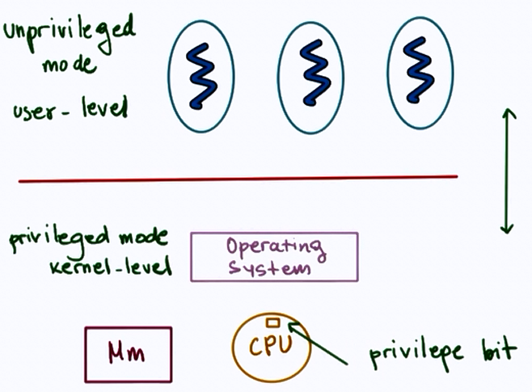
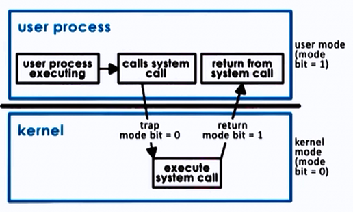
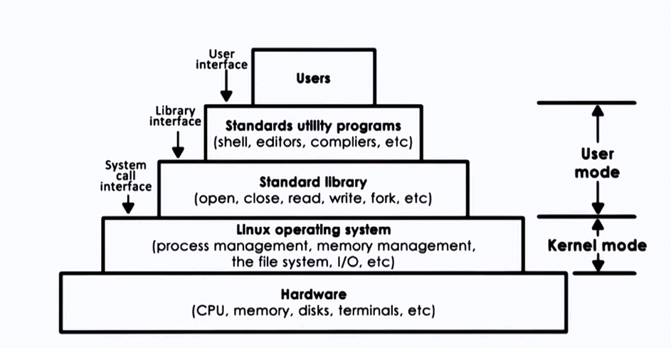

[<-- Повернутись назад](/README.md)

## Операційна система (ОС)

Операційна система (ОС) — це сукупність програмного забезпечення, яке керує апаратними ресурсами комп’ютера та надає загальні команди для програм. Операційна система є життєво важливим компонентом системного програмного забезпечення. 

ОС виступає інтерфейсом-посередником між користувачем та "залізом" комп’ютера. Це програмне забезпечення, яке виконує всі основні завдання, такі як керування файлами, управління пам'яттю, управління процесами, обробка введення-виводу, а також керування периферійними пристроями, такими як дисководи та принтери.

#### Значення операційної системи

- Посередник між програмним забезпеченням і апаратною складовою 
- Приховує складність апаратних процесів (читання/запис файлів для зберігання, надсилання/отримання сокетної мережі)
- Обробляє управління ресурсами (планування ЦП, управління пам'яттю)
- Забезпечує ізоляцію та захист (розподення різних частин пам’яті для різних програм, щоб програми не перезаписували одне одну)
- Забезпечує робочу політику (використання ресурсів, доступ) 

#### Приклади операційної системи:

ПК |Мобільні
-----------|------------
Microsoft Windows | Android OS 
MAC OS X (BSD) | iOS
LINUX | Symbian
...|...

#### Складові ОС 
- **Абстракції** (відповідає додаткам, які виконує ОС): процес, потік, файл, сокет, сторінка пам'яті 
- **Механізми** (поверх абстракцій): створювати, планувати, відкривати, писати, розподіляти 
- **Політики** (як механізми використовуються для керування базовим обладнанням)
- Алгоритм заміщення сторінок (**LRU**), Алгормитм планування по найменшому терміну (**EDF**) тощо.
    

#### Принципи проектування ОС

- Розділення механізму та політики
	- запровадити гнучкі механізми для підтримки багатьох політик
    - e.g. LRU, LFU, random
- Загальна оптимізація
	- Де буде використовуватися ОС?
    - Що користувач хоче виконати на цій машині?
    - Які вимоги до робочого навантаження?
    
#### Захист користувача / ядра

* рівень користувача - програми (непривілейований режим)
* рівень ядра - ядро ОС (привілейований доступ, апаратний доступ)

- Користувацько-ядерний перемикач підтримується апаратною складовою. 
	- виконуючи trap (дослівно з англ. - "пастка", але прямий переклад неумісний) інструкції
	- системні виклики, такі як:
		- відкрити / open (файл / file)
		- відправити / send (сокет / socket)
		- виділення / malloc (пам'ять / memory)
	- сигнали
    
#### Блок-схема системного виклику

    
- Щоб здійснити системний виклик, програма повинна:
	- аргументувати виклик
    - зберегти відповідні дані в добре захищеному місці
    - здійснити системний виклик, викорисовуючи його власний номер
- У той час синхронно: дочекайтеся завершення системного виклику

#### Основні послуги ОС

* керування процесами / process management
* керування файлами / file management
* керування пристроєм / device management
* керування пам'яттю / memory management
* керування збереженням / storage management
* безпека / security

#### Для прикладу розберемо деякі аспекти ОС Linux

##### Системні виклики Linux

Завдання|Команда
------------ | ------------
Process Control | fork (); exit(); wait(); 
File Manipulation | open(); read(); write();
Device Manipulation | ioctl(); read(); write();
Information Maintenance | getpid(); alarm(); sleep();
Communication | pipe(); shmget(); mmap();
Protection | chmod(); umask(); chown();

##### Архітектура Linux

Більш детально про всі концепції операційної системи можна ознайомитися у статті DevOps [Зрозумійте різні концепції ОС](../devops/understand-different-os-concepts.md).

> Інформацію для статті було взято та перекладено на українську з репозиторію GitHub [Aniruddha Tapas](https://github.com/Aniruddha-Tapas). Оригінал статті за посиланням - https://github.com/Aniruddha-Tapas/Operating-Systems-Notes/edit/master/1-Overview.md